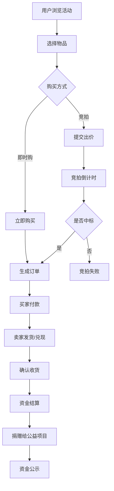

# 公益义卖与慈善拍卖活动平台 产品需求文档

## 1. 产品概述

公益义卖与慈善拍卖活动平台是专注于公益场景的在线拍卖与义卖平台。公益机构可创建义卖活动、上架捐赠物品，公众通过竞拍或即时购方式参与，全部成交款扣除运营成本后捐赠给指定公益项目，全程透明可追溯。

- 解决问题：传统公益募捐形式单一，缺乏互动性和趣味性，资金透明度不足
- 目标用户：公益机构、爱心捐赠者、竞拍参与者、公益项目受益方
- 产品价值：以趣味化的拍卖/义卖形式提升公益参与度，以全流程透明化建立公众信任

## 2. 核心功能

### 2.1 用户角色

| 角色 | 注册方式 | 核心权限 |
|------|----------|----------|
| 普通用户 | 手机号/邮箱注册 | 浏览活动、参与竞拍、即时购买、查看个人中心 |
| 公益机构 | 资质审核后注册 | 创建活动、上架物品、管理活动、查看数据报表 |
| 平台管理员 | 后台账号 | 审核机构、管理活动、查看全站数据 |

### 2.2 功能模块

1. **首页**：活动展示、热门拍品、筹款数据、公益项目介绍
2. **活动列表页**：活动分类筛选、搜索、排序
3. **活动详情页**：活动信息、物品列表、实时筹款进度、参与人数
4. **物品详情页**：物品信息、捐赠者信息、竞拍记录、出价/立即购买
5. **用户中心**：我的竞拍、我的订单、收货地址、账户设置
6. **机构后台**：活动管理、物品管理、订单管理、数据统计、公示报告
7. **资金公示页**：资金去向明细、捐赠收据公示

### 2.3 页面详情

| 页面名称 | 模块名称 | 功能描述 |
|----------|----------|----------|
| 首页 | 导航栏 | Logo、搜索、分类导航、登录/注册、用户入口 |
| 首页 | Hero区域 | 主题标语、当前筹款总额、累计捐赠金额、核心数据展示 |
| 首页 | 热门活动 | 精选活动卡片展示，支持滑动查看更多 |
| 首页 | 热门拍品 | 高人气拍卖物品展示 |
| 首页 | 公益项目 | 受助公益项目介绍 |
| 首页 | 透明公示 | 最新资金公示入口 |
| 活动列表页 | 筛选区 | 按类型、状态、时间筛选 |
| 活动列表页 | 活动卡片 | 活动封面、标题、机构、进度条、参与人数 |
| 活动详情页 | 活动信息 | 活动banner、标题、机构介绍、活动说明 |
| 活动详情页 | 数据概览 | 筹款进度条、已筹金额、目标金额、参与人数 |
| 活动详情页 | 物品列表 | Tab切换（全部/竞拍/即时购）、物品卡片网格 |
| 活动详情页 | 活动动态 | 最新出价记录、活动公告 |
| 物品详情页 | 物品展示 | 物品图片、名称、描述、捐赠者信息 |
| 物品详情页 | 竞拍区 | 当前最高价、起拍价、加价幅度、出价按钮 |
| 物品详情页 | 即时购 | 一口价、立即购买按钮 |
| 物品详情页 | 竞拍记录 | 历史出价列表、倒计时 |
| 物品详情页 | 服务/物流 | 物品类型标签（实物/体验/服务）、配送说明 |
| 用户中心 | 我的竞拍 | 进行中、已中拍、未中拍 |
| 用户中心 | 我的订单 | 待付款、待发货、待收货、已完成 |
| 用户中心 | 个人资料 | 头像、昵称、联系方式、收货地址 |
| 机构后台 | 数据概览 | 筹款总额、活动数、参与人数、物品数 |
| 机构后台 | 活动管理 | 创建、编辑、上下架活动 |
| 机构后台 | 物品管理 | 添加、编辑、删除物品 |
| 机构后台 | 订单管理 | 查看订单、发货、确认收货 |
| 机构后台 | 公示报告 | 生成活动结束后的公示报告 |
| 资金公示页 | 资金明细 | 收入明细、支出明细、最终捐赠金额 |
| 资金公示页 | 捐赠收据 | 每笔捐赠的收据凭证展示 |

## 3. 核心流程

### 3.1 竞拍流程

用户浏览活动 → 选择拍品 → 查看详情 → 提交出价（需登录）→ 系统确认出价 → 竞拍倒计时 → 活动结束 → 最高出价者中拍 → 买家付款 → 卖家发货/兑现服务 → 确认收货 → 资金结算 → 捐赠公示

### 3.2 即时购流程

用户浏览活动 → 选择物品 → 查看详情 → 立即购买（需登录）→ 确认订单 → 付款 → 卖家发货/兑现服务 → 确认收货 → 资金结算 → 捐赠公示

### 3.3 活动创建流程

机构登录后台 → 创建活动 → 填写活动信息 → 上架捐赠物品 → 提交审核 → 平台审核通过 → 活动上线

### 3.4 流程图

## 4. 用户界面设计

### 4.1 设计风格

- **设计理念**：温暖、信任、希望。以暖色调为主，传达公益的温度与力量。
- **主色调**：温暖珊瑚橙 (#FF6B4A) - 代表热情、温暖、生命力
- **辅助色**：
  - 森林绿 (#2D6A4F) - 代表希望、成长、可持续
  - 暖阳黄 (#FFD93D) - 代表光明、温暖、正能量
  - 深海蓝 (#1D3557) - 代表信任、专业、稳重
- **中性色**：米白 (#F8F5F0)、暖灰 (#8D8D8D)、深灰 (#333333)
- **按钮风格**：大圆角 (12px)、微立体阴影、悬停有微动效
- **字体**：标题使用"Noto Serif SC"宋体，传达正式与温度；正文使用"Noto Sans SC"无衬线体，保证可读性
- **布局风格**：卡片式布局、柔和阴影、 generous spacing
- **图标风格**：线性图标 + 暖色调填充，圆润可爱风格

### 4.2 页面设计概览

| 页面名称 | 模块名称 | UI元素 |
|----------|----------|--------|
| 首页 | Hero区域 | 大背景图 + 渐变蒙层、大号标题、核心数据数字动效、CTA按钮 |
| 首页 | 数据统计 | 四宫格数据卡片、数字滚动动画、图标点缀 |
| 首页 | 活动卡片 | 圆角卡片、图片占位、进度条动画、悬停上浮效果 |
| 活动详情页 | 活动头图 | 全宽banner、活动信息叠加、渐变过渡 |
| 活动详情页 | 进度条 | 渐变色进度条、实时数据更新、微光动画 |
| 物品详情页 | 竞拍区 | 醒目的当前价格、出价输入框、动态倒计时、出价按钮脉冲效果 |
| 物品详情页 | 出价记录 | 时间线样式、最新出价高亮 |
| 机构后台 | 数据看板 | 数据卡片网格、图表可视化、趋势指示 |
| 资金公示页 | 公示卡片 | 透明玻璃态效果、时间轴布局、收据缩略图 |

### 4.3 响应式设计

- 桌面端优先设计，适配 1200px+ 屏幕
- 平板端 (768px-1199px)：两列布局调整为单列，侧边栏收起
- 移动端 (375px-767px)：单列布局，底部导航，卡片自适应宽度
- 触摸优化：按钮最小 44px 点击区域，列表项增大点击热区

### 4.4 动效设计

- 页面加载：元素渐入 + 轻微上移动画，错落延迟
- 数据更新：数字滚动动画、进度条平滑过渡
- 交互反馈：按钮点击缩放、卡片悬停上浮、出价成功闪光
- 倒计时：最后10分钟数字变红并脉冲提醒
