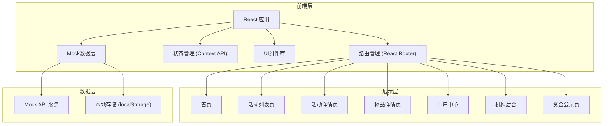
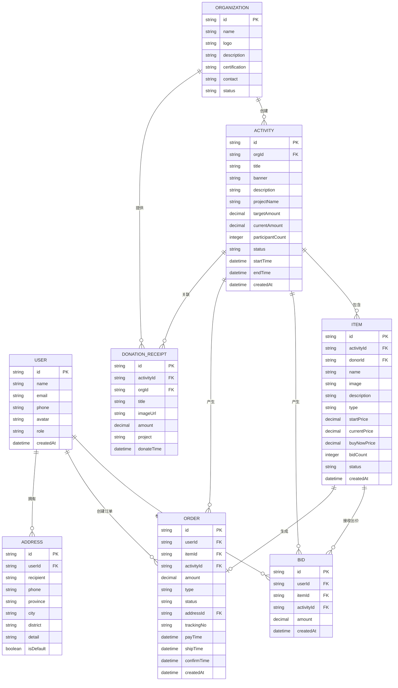

# 公益义卖与慈善拍卖活动平台 技术架构文档

## 1. 架构设计



## 2. 技术选型

### 2.1 前端技术栈

| 技术 | 版本 | 用途 |
|------|------|------|
| React | 18.x | 核心UI框架 |
| React Router | 6.x | 前端路由 |
| Vite | 5.x | 构建工具 |
| Tailwind CSS | 3.x | 样式框架 |
| TypeScript | 5.x | 类型系统 |
| Lucide React | 0.3.x | 图标库 |
| Recharts | 2.x | 图表组件 |

### 2.2 项目初始化

- 使用 Vite 初始化 React + TypeScript 项目
- 配置 Tailwind CSS 3.x
- 配置路径别名 @ 指向 src 目录
- 使用 ESLint + Prettier 代码规范

### 2.3 数据方案

- 前端 Mock 数据：使用静态 JSON 数据模拟后端接口
- 状态持久化：使用 localStorage 存储用户信息、竞拍记录等
- 状态管理：使用 React Context API 管理全局状态（用户、购物车等）

## 3. 目录结构

```
src/
├── assets/              # 静态资源
│   ├── images/         # 图片资源
│   └── styles/         # 全局样式
├── components/          # 公共组件
│   ├── common/         # 通用组件（Button、Card、Modal等）
│   ├── layout/         # 布局组件（Header、Footer、Sidebar等）
│   └── business/       # 业务组件（ActivityCard、ItemCard、BidRecord等）
├── pages/              # 页面组件
│   ├── Home/           # 首页
│   ├── ActivityList/   # 活动列表页
│   ├── ActivityDetail/ # 活动详情页
│   ├── ItemDetail/     # 物品详情页
│   ├── UserCenter/     # 用户中心
│   ├── OrgAdmin/       # 机构后台
│   └── Transparency/   # 资金公示页
├── context/            # Context 状态管理
│   ├── UserContext.tsx
│   └── ActivityContext.tsx
├── mock/               # Mock 数据
│   ├── activities.ts
│   ├── items.ts
│   ├── users.ts
│   └── bids.ts
├── types/              # TypeScript 类型定义
│   ├── index.ts
│   ├── activity.ts
│   ├── item.ts
│   ├── user.ts
│   └── bid.ts
├── utils/              # 工具函数
│   ├── format.ts       # 格式化工具
│   ├── date.ts         # 日期工具
│   └── storage.ts      # 本地存储工具
├── hooks/              # 自定义 Hooks
│   ├── useCountdown.ts
│   └── useBid.ts
├── router/             # 路由配置
│   └── index.tsx
├── App.tsx
└── main.tsx
```

## 4. 路由定义

| 路由路径 | 页面名称 | 说明 |
|----------|----------|------|
| / | 首页 | 展示热门活动、数据统计等 |
| /activities | 活动列表页 | 活动筛选、搜索、列表展示 |
| /activity/:id | 活动详情页 | 活动信息、物品列表、筹款进度 |
| /item/:id | 物品详情页 | 物品信息、竞拍/购买功能 |
| /user | 用户中心首页 | 用户数据概览 |
| /user/bids | 我的竞拍 | 竞拍记录列表 |
| /user/orders | 我的订单 | 订单列表 |
| /user/profile | 个人资料 | 个人信息设置 |
| /org | 机构后台首页 | 数据看板 |
| /org/activities | 活动管理 | 活动列表、创建编辑 |
| /org/items | 物品管理 | 物品列表、上下架 |
| /org/orders | 订单管理 | 订单处理、发货 |
| /org/report | 公示报告 | 生成公示报告 |
| /transparency | 资金公示页 | 资金明细、捐赠收据 |

## 5. 数据模型

### 5.1 ER图



### 5.2 核心类型定义

```typescript
// 用户类型
interface User {
  id: string;
  name: string;
  email: string;
  phone: string;
  avatar: string;
  role: 'user' | 'organization' | 'admin';
  createdAt: string;
}

// 公益机构
interface Organization {
  id: string;
  name: string;
  logo: string;
  description: string;
  certification: string;
  contact: string;
  status: 'pending' | 'approved' | 'rejected';
}

// 活动
interface Activity {
  id: string;
  orgId: string;
  orgName: string;
  orgLogo: string;
  title: string;
  banner: string;
  description: string;
  projectName: string;
  targetAmount: number;
  currentAmount: number;
  participantCount: number;
  itemCount: number;
  status: 'upcoming' | 'ongoing' | 'ended';
  startTime: string;
  endTime: string;
  createdAt: string;
}

// 物品/拍品
interface Item {
  id: string;
  activityId: string;
  donorId: string;
  donorName: string;
  donorAvatar: string;
  name: string;
  image: string;
  images: string[];
  description: string;
  type: 'physical' | 'experience' | 'service';
  startPrice: number;
  currentPrice: number;
  buyNowPrice?: number;
  bidCount: number;
  status: 'active' | 'sold' | 'ended';
  deliveryDesc: string;
  createdAt: string;
}

// 竞拍记录
interface Bid {
  id: string;
  userId: string;
  userName: string;
  userAvatar: string;
  itemId: string;
  activityId: string;
  amount: number;
  createdAt: string;
}

// 订单
interface Order {
  id: string;
  userId: string;
  itemId: string;
  activityId: string;
  itemName: string;
  itemImage: string;
  amount: number;
  type: 'auction' | 'buynow';
  status: 'pending_pay' | 'paid' | 'shipped' | 'completed' | 'cancelled';
  addressId?: string;
  trackingNo?: string;
  payTime?: string;
  shipTime?: string;
  confirmTime?: string;
  createdAt: string;
}

// 捐赠收据
interface DonationReceipt {
  id: string;
  activityId: string;
  orgName: string;
  title: string;
  imageUrl: string;
  amount: number;
  project: string;
  donateTime: string;
}
```

## 6. 核心功能实现方案

### 6.1 竞拍功能

- 使用 useState 管理当前出价
- 倒计时使用自定义 Hook useCountdown
- 出价验证：必须高于当前价 + 加价幅度
- 竞拍记录实时更新（模拟）
- 活动结束自动生成中标订单

### 6.2 进度条与数据统计

- 使用 Recharts 展示图表数据
- 数字滚动动画效果
- 筹款进度 = 已筹金额 / 目标金额 * 100%

### 6.3 状态管理

- UserContext：管理用户登录状态、用户信息
- ActivityContext：管理活动筛选条件等全局状态
- localStorage：持久化用户登录状态、收藏记录等

### 6.4 Mock 数据

- 预置 5-8 个示例活动
- 每个活动 8-15 件拍品
- 模拟竞拍记录、订单数据
- 模拟捐赠收据数据
